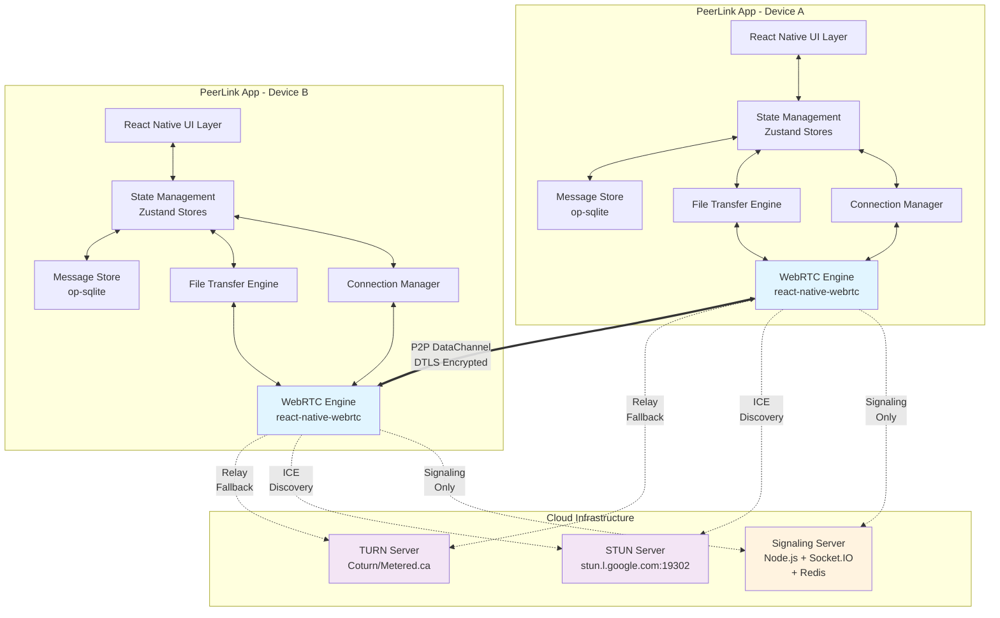
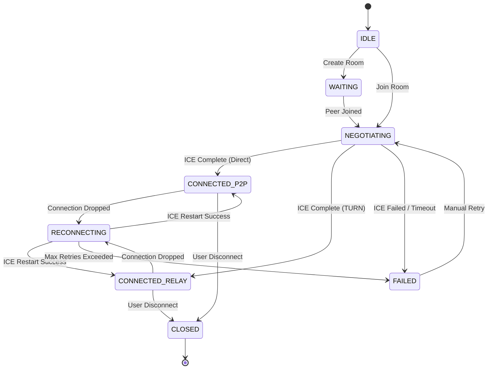
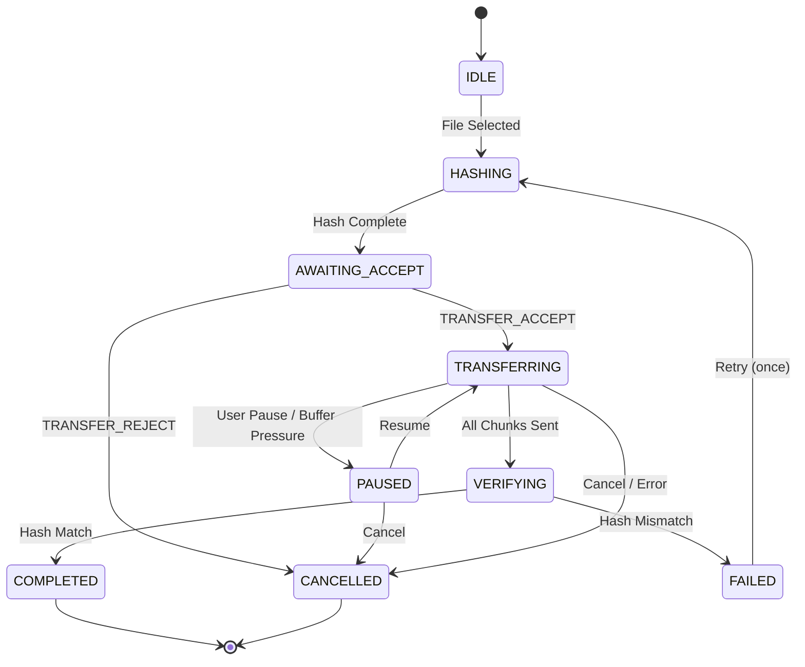
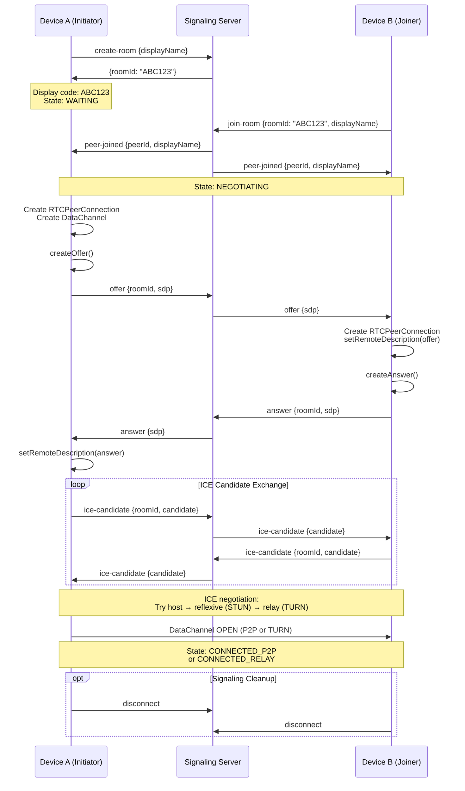
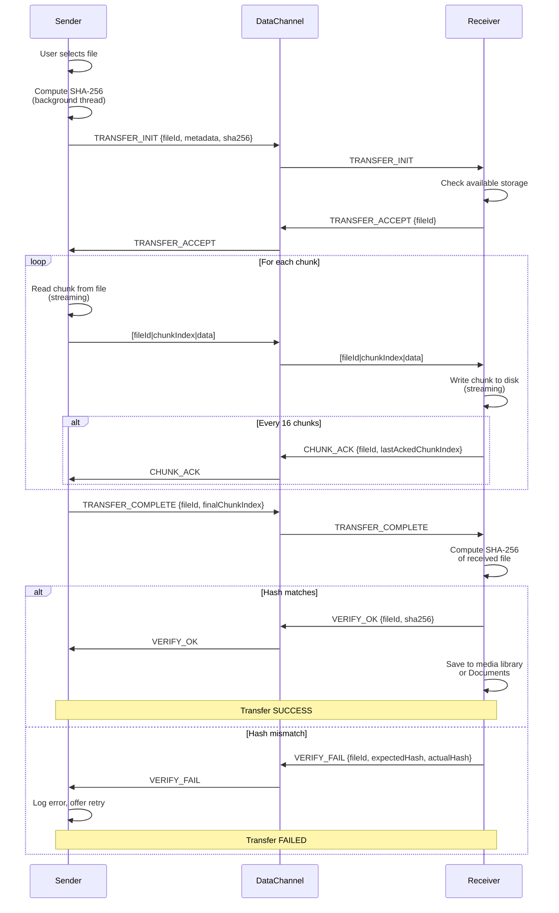
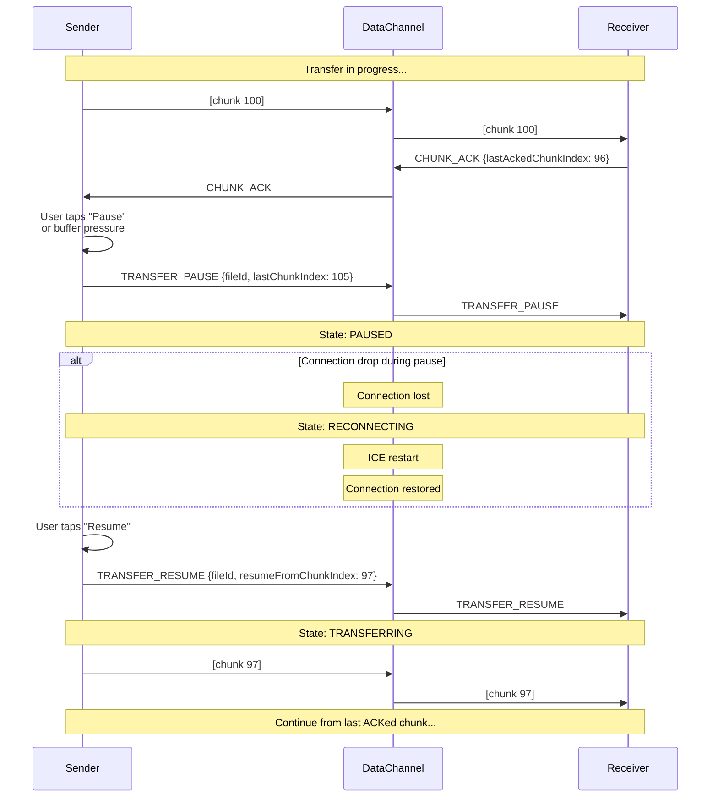

# Design Document: PeerLink Mobile

## Overview

PeerLink Mobile is an Android-first React Native application that enables direct peer-to-peer communication between two mobile devices using WebRTC DataChannels. The application provides real-time text messaging and large file transfer capabilities (up to 4 GB) without routing user data through central servers, ensuring privacy and maximizing transfer speeds.

### Key Design Goals

1. **Direct P2P Communication**: All user data (messages and files) flows directly between peers after connection establishment, with no intermediary servers in the data path
2. **Privacy by Default**: DTLS 1.2/1.3 encryption is mandatory for all DataChannel traffic, with no opt-out mechanism
3. **High Performance**: Achieve ≥80% of available bandwidth for file transfers through dynamic chunking and buffer management
4. **Reliability**: Support automatic reconnection, file transfer resume, and graceful degradation to TURN relay when direct P2P fails
5. **Android-Specific Optimization**: Leverage Android 10+ (API 29) features including foreground services for persistent connections and scoped storage for file management

### Technology Stack

- **Framework**: React Native 0.73+ with New Architecture (Fabric renderer, TurboModules)
- **WebRTC**: react-native-webrtc 118.0.0+ (based on Chromium M118)
- **State Management**: Zustand 4.5+ with persistence middleware
- **Database**: op-sqlite 5.0+ for high-performance message storage
- **File I/O**: react-native-fs 2.20+ for streaming chunk operations
- **Signaling**: Socket.IO client 4.7+ connecting to Node.js + Socket.IO 4.7 backend
- **Platform**: Android 10+ (API 29, minSdkVersion 29, targetSdkVersion 34)

### Architecture Principles

1. **Separation of Concerns**: Clear boundaries between WebRTC layer, application logic, UI, and data persistence
2. **State Machine-Driven**: Connection lifecycle managed by explicit finite state machine with well-defined transitions
3. **Streaming Architecture**: Large files never fully loaded into memory; all operations use streaming I/O
4. **Defensive Programming**: Explicit error handling at every network and I/O boundary with user-visible feedback
5. **Performance-First**: DataChannel buffer management, dynamic chunk sizing, and background threading for hash computation

## Architecture


### High-Level System Architecture



### Data Flow Architecture


**Connection Establishment Flow**:

1. User A creates room → Signaling Server generates 6-char code → User B enters code
2. Signaling Server emits "peer-joined" to both devices
3. Device A creates RTCPeerConnection, DataChannel, generates SDP offer → relayed via Signaling Server
4. Device B receives offer, creates RTCPeerConnection, generates SDP answer → relayed via Signaling Server
5. Both devices exchange ICE candidates via Signaling Server
6. ICE agents attempt connection: host → reflexive (STUN) → relay (TURN)
7. DataChannel "open" event fires → P2P channel established → Signaling connection no longer needed

**Message Transmission Flow**:

1. User types message → UI updates immediately (optimistic)
2. Message serialized to JSON → sent over DataChannel
3. Remote device receives → stores in Message Store → UI updates
4. If send fails → mark as error → allow retry

**File Transfer Flow**:

1. User selects file → extract metadata → compute SHA-256 hash (background thread)
2. Send TRANSFER_INIT with metadata + hash → remote accepts/rejects
3. Read file in streaming chunks (16-64 KB) → send with 8-byte header (fileId + chunkIndex)
4. Monitor DataChannel bufferedAmount → pause if threshold exceeded
5. Receiver writes chunks to disk → sends CHUNK_ACK every 16 chunks
6. After final chunk → receiver computes hash → compares → sends VERIFY_OK/FAIL
7. On success → save to media library or Documents folder

### Android-Specific Components

**Foreground Service for Persistent Connections**:
- Displayed as ongoing notification during active transfers
- Prevents process termination during large file transfers
- Required permission: `android.permission.FOREGROUND_SERVICE` (API 28+)
- Service type: `dataSync` (API 34+) for file transfer operations

**Scoped Storage Integration (API 29+)**:
- Media files (images/videos) saved to MediaStore using `MediaStore.Images.Media` / `MediaStore.Video.Media`
- Other files saved to app-specific directory (`getExternalFilesDir()`)
- No broad storage permissions required (`READ_EXTERNAL_STORAGE` / `WRITE_EXTERNAL_STORAGE` deprecated)

**Network Callback Integration**:
- Monitor network availability using `ConnectivityManager.NetworkCallback`
- Trigger automatic reconnection on network restoration
- Display network status in connection indicator

## Components and Interfaces


### Connection Manager

**Responsibility**: Manages WebRTC peer connection lifecycle, ICE negotiation, DataChannel establishment, and connection state machine.

**State Machine**:



**Key Methods**:

```typescript
interface IConnectionManager {
  // Room Management
  createRoom(displayName: string): Promise<{roomId: string}>;
  joinRoom(roomId: string, displayName: string): Promise<void>;
  
  // Connection Lifecycle
  initiatePeerConnection(config: RTCConfiguration): void;
  handleOffer(sdp: RTCSessionDescriptionInit): Promise<void>;
  handleAnswer(sdp: RTCSessionDescriptionInit): Promise<void>;
  handleIceCandidate(candidate: RTCIceCandidateInit): Promise<void>;
  
  // State Management
  getConnectionState(): ConnectionState;
  onStateChange(callback: (state: ConnectionState) => void): void;
  
  // Reconnection
  initiateIceRestart(): Promise<void>;
  disconnect(): void;
  
  // DataChannel Access
  getDataChannel(): RTCDataChannel | null;
}

enum ConnectionState {
  IDLE = 'IDLE',
  WAITING = 'WAITING',
  NEGOTIATING = 'NEGOTIATING',
  CONNECTED_P2P = 'CONNECTED_P2P',
  CONNECTED_RELAY = 'CONNECTED_RELAY',
  RECONNECTING = 'RECONNECTING',
  FAILED = 'FAILED',
  CLOSED = 'CLOSED'
}
```

**Implementation Details**:

- RTCPeerConnection configuration includes STUN server (`stun.l.google.com:19302`) and optional TURN server from settings
- DataChannel created with label `"peerlink-data"`, ordered: true, maxRetransmits: undefined (reliable mode)
- ICE gathering timeout: 10 seconds
- Connection establishment timeout: 15 seconds (from createOffer to DataChannel open)
- Reconnection strategy: exponential backoff (1s, 2s, 4s), max 3 attempts
- ICE candidate pair type detection using `getStats()` API to distinguish P2P vs TURN


### File Transfer Engine

**Responsibility**: Manages chunked file transmission, progress tracking, flow control, pause/resume, and integrity verification.

**File Transfer State Machine**:



**Key Methods**:

```typescript
interface IFileTransferEngine {
  // Sender Methods
  initiateSend(fileUri: string, fileName: string, fileSize: number, mimeType: string): Promise<string>; // returns fileId
  pauseTransfer(fileId: string): void;
  resumeTransfer(fileId: string): void;
  cancelTransfer(fileId: string): void;
  
  // Receiver Methods
  handleTransferInit(metadata: TransferInitMessage): Promise<void>;
  handleChunk(data: ArrayBuffer): Promise<void>;
  handleTransferComplete(fileId: string): Promise<void>;
  
  // Progress Monitoring
  onProgress(fileId: string, callback: (progress: TransferProgress) => void): void;
}

interface TransferInitMessage {
  type: 'TRANSFER_INIT';
  fileId: string;
  fileName: string;
  fileSize: number;
  mimeType: string;
  chunkSize: number;
  totalChunks: number;
  sha256: string;
}

interface TransferProgress {
  fileId: string;
  fileName: string;
  bytesTransferred: number;
  totalBytes: number;
  percentage: number;
  speedBytesPerSec: number;
  etaSeconds: number;
  lastAckedChunk: number;
}
```

**Chunking Strategy**:

- Initial chunk size: 16 KB
- Increase to 32 KB after 5 consecutive successful chunks with stable throughput
- Increase to 64 KB after 10 consecutive chunks at 32 KB
- Decrease to 16 KB if DataChannel bufferedAmount exceeds threshold
- bufferedAmountLowThreshold: 256 KB
- Maximum chunk size: 64 KB

**Flow Control**:

- Receiver sends CHUNK_ACK every 16 chunks
- Sender waits for ACK before continuing if 32 chunks sent without acknowledgment
- Timeout for ACK: 30 seconds → pause and display "Waiting for peer"

**Hash Computation**:

- Read file in 1 MB blocks using react-native-fs streaming API
- Compute SHA-256 using native crypto module (Android: java.security.MessageDigest)
- Run on background thread using react-native-threading or Hermes async execution
- Progress callback every 10% for large files

**File I/O**:

- Sender: Stream file using `RNFS.read()` with position and length parameters
- Receiver: Write chunks using `RNFS.appendFile()` to avoid memory accumulation
- Temp file path: `${RNFS.CachesDirectoryPath}/transfers/${fileId}.tmp`
- On completion: move from cache to final destination (MediaStore or Documents)


### Message Store

**Responsibility**: Persist chat message history, file transfer metadata, and room information in a local SQLite database.

**Key Methods**:

```typescript
interface IMessageStore {
  // Message Operations
  saveMessage(message: Message): Promise<void>;
  getMessages(roomId: string, limit?: number, offset?: number): Promise<Message[]>;
  updateMessageStatus(messageId: string, status: MessageStatus): Promise<void>;
  deleteMessages(roomId: string): Promise<void>;
  
  // Room Operations
  saveRoom(room: Room): Promise<void>;
  getRoom(roomId: string): Promise<Room | null>;
  getAllRooms(): Promise<Room[]>;
  deleteRoom(roomId: string): Promise<void>;
  
  // Transfer State Persistence
  saveTransferState(fileId: string, state: TransferState): Promise<void>;
  getTransferState(fileId: string): Promise<TransferState | null>;
  deleteTransferState(fileId: string): Promise<void>;
}

interface Message {
  id: string;              // UUID
  roomId: string;
  senderId: 'local' | 'remote';
  type: 'text' | 'file';
  content: string;         // For text: message body, for file: file name
  fileName?: string;
  fileSize?: number;
  fileMimeType?: string;
  filePath?: string;       // Local path after transfer complete
  status: MessageStatus;
  timestamp: string;       // ISO8601
  transferProgress?: number;
}

enum MessageStatus {
  SENDING = 'sending',
  SENT = 'sent',
  DELIVERED = 'delivered',
  ERROR = 'error',
  CANCELLED = 'cancelled'
}

interface Room {
  id: string;              // 6-char room code
  displayName: string;     // Peer's display name
  lastActivity: string;    // ISO8601
  isPersistent: boolean;   // For future multi-session support
}

interface TransferState {
  fileId: string;
  fileName: string;
  fileSize: number;
  lastAckedChunk: number;
  tempFilePath: string;
  sha256: string;
  direction: 'send' | 'receive';
}
```

**Implementation with op-sqlite**:

op-sqlite offers significant performance advantages ([5x faster and 5x less memory](https://ospfranco.com/post/2023/11/09/sqlite-for-react-native,-but-5x-faster-and-5x-less-memory/)) compared to traditional react-native-sqlite-storage due to JSI (JavaScript Interface) integration that eliminates the React Native bridge overhead.

- Use synchronous API for write operations to ensure immediate persistence
- Use asynchronous API for read operations to prevent UI blocking
- Batch inserts for initial history load
- Connection pool size: 1 (single writer, multiple readers pattern)
- WAL mode enabled for concurrent read/write performance
- Auto-vacuum enabled to prevent database bloat


### Signaling Coordinator

**Responsibility**: Interface between application and Socket.IO signaling server for SDP/ICE exchange and room management.

**Key Methods**:

```typescript
interface ISignalingCoordinator {
  // Connection Management
  connect(serverUrl: string): Promise<void>;
  disconnect(): void;
  isConnected(): boolean;
  
  // Room Operations
  createRoom(displayName: string): Promise<{roomId: string}>;
  joinRoom(roomId: string, displayName: string): Promise<void>;
  leaveRoom(roomId: string): void;
  
  // Signaling Messages
  sendOffer(roomId: string, sdp: RTCSessionDescriptionInit): void;
  sendAnswer(roomId: string, sdp: RTCSessionDescriptionInit): void;
  sendIceCandidate(roomId: string, candidate: RTCIceCandidateInit): void;
  
  // Event Listeners
  onPeerJoined(callback: (peerId: string, displayName: string) => void): void;
  onOffer(callback: (sdp: RTCSessionDescriptionInit) => void): void;
  onAnswer(callback: (sdp: RTCSessionDescriptionInit) => void): void;
  onIceCandidate(callback: (candidate: RTCIceCandidateInit) => void): void;
  onPeerDisconnected(callback: (peerId: string) => void): void;
  onRoomError(callback: (error: RoomError) => void): void;
}

interface RoomError {
  type: 'room-not-found' | 'room-full' | 'connection-error';
  message: string;
}
```

**Socket.IO Events**:

Client → Server:
- `create-room`: `{displayName}` → `{roomId}`
- `join-room`: `{roomId, displayName}` → ack or error
- `offer`: `{roomId, sdp}`
- `answer`: `{roomId, sdp}`
- `ice-candidate`: `{roomId, candidate}`

Server → Client:
- `peer-joined`: `{peerId, displayName}`
- `offer`: `{sdp}`
- `answer`: `{sdp}`
- `ice-candidate`: `{candidate}`
- `peer-disconnected`: `{peerId}`
- `room-full`: `{roomId}`
- `room-not-found`: `{roomId}`

**Connection Management**:

- Auto-reconnect with exponential backoff: 1s, 2s, 4s, 8s (max 4 attempts)
- Heartbeat ping every 25 seconds to maintain WebSocket
- Disconnect from signaling server 5 seconds after DataChannel opens (optional optimization)
- Reconnect to signaling server only for ICE restart

### State Management Architecture

**Zustand Stores**:

Three separate stores for clear separation of concerns and performance optimization:


**1. Connection Store** (`useConnectionStore`):

```typescript
interface ConnectionStore {
  // State
  connectionState: ConnectionState;
  roomId: string | null;
  peerDisplayName: string | null;
  localDisplayName: string | null;
  connectionType: 'direct' | 'relay' | null;
  reconnectAttempts: number;
  
  // Actions
  setConnectionState: (state: ConnectionState) => void;
  setRoomId: (roomId: string) => void;
  setPeerInfo: (displayName: string) => void;
  setConnectionType: (type: 'direct' | 'relay') => void;
  incrementReconnectAttempts: () => void;
  resetReconnectAttempts: () => void;
  reset: () => void;
}
```

**2. Message Store** (`useMessageStore`):

```typescript
interface MessageStore {
  // State
  messages: Record<string, Message[]>; // roomId -> Message[]
  activeRoomId: string | null;
  
  // Actions
  addMessage: (roomId: string, message: Message) => void;
  updateMessageStatus: (messageId: string, status: MessageStatus) => void;
  loadMessages: (roomId: string) => Promise<void>;
  clearMessages: (roomId: string) => void;
  setActiveRoom: (roomId: string) => void;
}
```

**3. Transfer Store** (`useTransferStore`):

```typescript
interface TransferStore {
  // State
  activeTransfers: Record<string, TransferProgress>; // fileId -> progress
  
  // Actions
  startTransfer: (fileId: string, metadata: FileMetadata) => void;
  updateProgress: (fileId: string, progress: Partial<TransferProgress>) => void;
  pauseTransfer: (fileId: string) => void;
  resumeTransfer: (fileId: string) => void;
  cancelTransfer: (fileId: string) => void;
  completeTransfer: (fileId: string) => void;
  removeTransfer: (fileId: string) => void;
}
```

**Persistence Strategy**:

- Connection Store: No persistence (session-only state)
- Message Store: Persist `activeRoomId` only using AsyncStorage
- Transfer Store: Persist `activeTransfers` using AsyncStorage for resume capability after app restart

**Store Integration**:

```typescript
// Example: Connection Manager updates Connection Store
connectionManager.onStateChange((state) => {
  useConnectionStore.getState().setConnectionState(state);
});

// Example: UI observes Transfer Store
const activeTransfers = useTransferStore((state) => state.activeTransfers);
```

## WebRTC DataChannel Protocol Design


### Message Types

All control messages are JSON-encoded strings. File chunks are binary ArrayBuffers.

**Text Message**:
```json
{
  "type": "TEXT_MESSAGE",
  "messageId": "550e8400-e29b-41d4-a716-446655440000",
  "content": "Hello, world!",
  "timestamp": "2026-06-15T14:32:10.123Z"
}
```

**File Transfer Control Messages**:

**TRANSFER_INIT** (Sender → Receiver):
```json
{
  "type": "TRANSFER_INIT",
  "fileId": "7f3a8c2e-9b4d-41f6-8e5a-1d2c3b4a5e6f",
  "fileName": "document.pdf",
  "fileSize": 104857600,
  "mimeType": "application/pdf",
  "chunkSize": 16384,
  "totalChunks": 6400,
  "sha256": "e3b0c44298fc1c149afbf4c8996fb92427ae41e4649b934ca495991b7852b855"
}
```

**TRANSFER_ACCEPT** (Receiver → Sender):
```json
{
  "type": "TRANSFER_ACCEPT",
  "fileId": "7f3a8c2e-9b4d-41f6-8e5a-1d2c3b4a5e6f"
}
```

**TRANSFER_REJECT** (Receiver → Sender):
```json
{
  "type": "TRANSFER_REJECT",
  "fileId": "7f3a8c2e-9b4d-41f6-8e5a-1d2c3b4a5e6f",
  "reason": "insufficient_storage"
}
```

**CHUNK_ACK** (Receiver → Sender):
```json
{
  "type": "CHUNK_ACK",
  "fileId": "7f3a8c2e-9b4d-41f6-8e5a-1d2c3b4a5e6f",
  "lastAckedChunkIndex": 160
}
```

**TRANSFER_PAUSE** (Either → Other):
```json
{
  "type": "TRANSFER_PAUSE",
  "fileId": "7f3a8c2e-9b4d-41f6-8e5a-1d2c3b4a5e6f",
  "lastChunkIndex": 200
}
```

**TRANSFER_RESUME** (Either → Other):
```json
{
  "type": "TRANSFER_RESUME",
  "fileId": "7f3a8c2e-9b4d-41f6-8e5a-1d2c3b4a5e6f",
  "resumeFromChunkIndex": 161
}
```

**TRANSFER_ABORT** (Either → Other):
```json
{
  "type": "TRANSFER_ABORT",
  "fileId": "7f3a8c2e-9b4d-41f6-8e5a-1d2c3b4a5e6f",
  "reason": "user_cancelled"
}
```

**TRANSFER_COMPLETE** (Sender → Receiver):
```json
{
  "type": "TRANSFER_COMPLETE",
  "fileId": "7f3a8c2e-9b4d-41f6-8e5a-1d2c3b4a5e6f",
  "finalChunkIndex": 6399
}
```

**VERIFY_OK** (Receiver → Sender):
```json
{
  "type": "VERIFY_OK",
  "fileId": "7f3a8c2e-9b4d-41f6-8e5a-1d2c3b4a5e6f",
  "sha256": "e3b0c44298fc1c149afbf4c8996fb92427ae41e4649b934ca495991b7852b855"
}
```

**VERIFY_FAIL** (Receiver → Sender):
```json
{
  "type": "VERIFY_FAIL",
  "fileId": "7f3a8c2e-9b4d-41f6-8e5a-1d2c3b4a5e6f",
  "expectedHash": "e3b0c44298fc1c149afbf4c8996fb92427ae41e4649b934ca495991b7852b855",
  "actualHash": "1234567890abcdef1234567890abcdef1234567890abcdef1234567890abcdef"
}
```

### Binary Chunk Format


Each file chunk is sent as an ArrayBuffer with the following structure:

```
+------------------+------------------+---------------------------+
|    fileId (4B)   | chunkIndex (4B)  |  Chunk Data (variable)   |
+------------------+------------------+---------------------------+
    uint32            uint32              byte[]
```

**Encoding**:
- fileId: First 4 bytes of UUID converted to uint32 (sufficient uniqueness for active transfers)
- chunkIndex: Zero-based chunk number as uint32 big-endian
- Chunk Data: Raw file bytes (16 KB - 64 KB)

**Parsing on Receive**:
```typescript
function parseChunk(buffer: ArrayBuffer): {fileId: number, chunkIndex: number, data: ArrayBuffer} {
  const view = new DataView(buffer);
  const fileId = view.getUint32(0, false); // big-endian
  const chunkIndex = view.getUint32(4, false);
  const data = buffer.slice(8);
  return {fileId, chunkIndex, data};
}
```

### Message Sequencing and Reliability

**Ordered Delivery**:
- DataChannel configured with `ordered: true` → SCTP reliable ordered delivery
- No application-level sequence numbers needed for messages
- Chunk index embedded in chunk header for resume capability

**Retry Logic**:
- Text messages: No automatic retry (mark as error, allow manual retry)
- File chunks: Automatic resume from last ACKed chunk on reconnection
- Hash verification failure: One automatic retry before surfacing error

**Buffer Management**:
```typescript
function sendChunk(dataChannel: RTCDataChannel, chunk: ArrayBuffer) {
  if (dataChannel.bufferedAmount > 256 * 1024) {
    // Pause until buffer drains
    dataChannel.addEventListener('bufferedamountlow', () => {
      sendChunk(dataChannel, chunk);
    }, {once: true});
    return;
  }
  dataChannel.send(chunk);
}
```

## File Transfer Protocol Specification

### Connection Establishment Sequence




### File Transfer Sequence (Happy Path)



### File Transfer Sequence (Pause and Resume)




## Data Models and Schemas

### SQLite Database Schema

**messages table**:
```sql
CREATE TABLE messages (
  id TEXT PRIMARY KEY,              -- UUID
  room_id TEXT NOT NULL,
  sender_id TEXT NOT NULL,          -- 'local' or 'remote'
  type TEXT NOT NULL,               -- 'text' or 'file'
  content TEXT NOT NULL,
  file_name TEXT,
  file_size INTEGER,
  file_mime_type TEXT,
  file_path TEXT,
  status TEXT NOT NULL,             -- 'sending', 'sent', 'delivered', 'error', 'cancelled'
  timestamp TEXT NOT NULL,          -- ISO8601
  transfer_progress INTEGER,
  FOREIGN KEY (room_id) REFERENCES rooms(id) ON DELETE CASCADE
);

CREATE INDEX idx_messages_room_timestamp ON messages(room_id, timestamp);
CREATE INDEX idx_messages_status ON messages(status);
```

**rooms table**:
```sql
CREATE TABLE rooms (
  id TEXT PRIMARY KEY,              -- 6-char room code
  display_name TEXT NOT NULL,       -- Peer's display name
  last_activity TEXT NOT NULL,      -- ISO8601
  is_persistent INTEGER DEFAULT 0   -- Boolean: 0 = session only, 1 = persistent
);

CREATE INDEX idx_rooms_last_activity ON rooms(last_activity DESC);
```

**transfer_states table**:
```sql
CREATE TABLE transfer_states (
  file_id TEXT PRIMARY KEY,
  file_name TEXT NOT NULL,
  file_size INTEGER NOT NULL,
  last_acked_chunk INTEGER NOT NULL DEFAULT 0,
  temp_file_path TEXT NOT NULL,
  sha256 TEXT NOT NULL,
  direction TEXT NOT NULL,          -- 'send' or 'receive'
  created_at TEXT NOT NULL,         -- ISO8601
  updated_at TEXT NOT NULL          -- ISO8601
);

CREATE INDEX idx_transfer_states_updated ON transfer_states(updated_at DESC);
```

### TypeScript Data Models


**Core Domain Models**:

```typescript
// Message Model
interface Message {
  id: string;
  roomId: string;
  senderId: 'local' | 'remote';
  type: 'text' | 'file';
  content: string;
  fileName?: string;
  fileSize?: number;
  fileMimeType?: string;
  filePath?: string;
  status: MessageStatus;
  timestamp: string;
  transferProgress?: number;
}

enum MessageStatus {
  SENDING = 'sending',
  SENT = 'sent',
  DELIVERED = 'delivered',
  ERROR = 'error',
  CANCELLED = 'cancelled'
}

// Room Model
interface Room {
  id: string;
  displayName: string;
  lastActivity: string;
  isPersistent: boolean;
}

// Transfer State Model
interface TransferState {
  fileId: string;
  fileName: string;
  fileSize: number;
  lastAckedChunk: number;
  tempFilePath: string;
  sha256: string;
  direction: 'send' | 'receive';
  createdAt: string;
  updatedAt: string;
}

// Transfer Progress Model
interface TransferProgress {
  fileId: string;
  fileName: string;
  bytesTransferred: number;
  totalBytes: number;
  percentage: number;
  speedBytesPerSec: number;
  etaSeconds: number;
  lastAckedChunk: number;
  state: TransferState;
}

enum TransferProgressState {
  HASHING = 'hashing',
  AWAITING_ACCEPT = 'awaiting_accept',
  TRANSFERRING = 'transferring',
  PAUSED = 'paused',
  VERIFYING = 'verifying',
  COMPLETED = 'completed',
  FAILED = 'failed',
  CANCELLED = 'cancelled'
}

// WebRTC Configuration Model
interface RTCConfigurationExtended extends RTCConfiguration {
  iceServers: RTCIceServer[];
  iceTransportPolicy?: 'all' | 'relay';
  bundlePolicy?: 'balanced' | 'max-compat' | 'max-bundle';
  rtcpMuxPolicy?: 'negotiate' | 'require';
  iceCandidatePoolSize?: number;
}

// Connection Info Model
interface ConnectionInfo {
  state: ConnectionState;
  type: 'direct' | 'relay' | null;
  localCandidate: RTCIceCandidate | null;
  remoteCandidate: RTCIceCandidate | null;
  bytesSent: number;
  bytesReceived: number;
  rtt: number; // Round-trip time in milliseconds
}
```

## API and Interface Contracts

### Connection Manager Public API


```typescript
class ConnectionManager {
  constructor(
    private signalingCoordinator: ISignalingCoordinator,
    private config: RTCConfigurationExtended
  ) {}
  
  /**
   * Creates a new room and returns the room code.
   * Transitions to WAITING state.
   * @throws {SignalingError} if signaling server is unreachable
   */
  async createRoom(displayName: string): Promise<{roomId: string}>;
  
  /**
   * Joins an existing room with the provided code.
   * Transitions to NEGOTIATING state.
   * @throws {RoomNotFoundError} if room doesn't exist
   * @throws {RoomFullError} if room already has 2 peers
   */
  async joinRoom(roomId: string, displayName: string): Promise<void>;
  
  /**
   * Returns current connection state.
   */
  getConnectionState(): ConnectionState;
  
  /**
   * Returns connection statistics (bytes sent/received, RTT, etc.).
   * @returns null if not connected
   */
  async getConnectionStats(): Promise<ConnectionInfo | null>;
  
  /**
   * Registers callback for connection state changes.
   * Returns unsubscribe function.
   */
  onStateChange(callback: (state: ConnectionState) => void): () => void;
  
  /**
   * Returns the active DataChannel if connected, null otherwise.
   */
  getDataChannel(): RTCDataChannel | null;
  
  /**
   * Initiates ICE restart to recover from connection drop.
   * Only valid in RECONNECTING state.
   */
  async initiateIceRestart(): Promise<void>;
  
  /**
   * Closes the peer connection and transitions to CLOSED state.
   * Cleans up all resources.
   */
  disconnect(): void;
}
```

### File Transfer Engine Public API

```typescript
class FileTransferEngine {
  constructor(
    private connectionManager: ConnectionManager,
    private messageStore: IMessageStore
  ) {}
  
  /**
   * Initiates file send. Computes hash on background thread.
   * @returns fileId for tracking progress
   * @throws {FileReadError} if file cannot be read
   * @throws {NotConnectedError} if DataChannel is not open
   */
  async initiateSend(
    fileUri: string,
    fileName: string,
    fileSize: number,
    mimeType: string
  ): Promise<string>;
  
  /**
   * Pauses an active transfer. Idempotent.
   */
  pauseTransfer(fileId: string): void;
  
  /**
   * Resumes a paused transfer from last ACKed chunk.
   * @throws {TransferNotFoundError} if fileId invalid
   */
  resumeTransfer(fileId: string): void;
  
  /**
   * Cancels transfer and cleans up partial files.
   */
  cancelTransfer(fileId: string): void;
  
  /**
   * Registers progress callback for specific transfer.
   * Returns unsubscribe function.
   */
  onProgress(
    fileId: string,
    callback: (progress: TransferProgress) => void
  ): () => void;
  
  /**
   * Registers completion callback.
   */
  onComplete(
    fileId: string,
    callback: (success: boolean, filePath?: string) => void
  ): () => void;
  
  /**
   * Internal: handles incoming TRANSFER_INIT from peer.
   */
  handleTransferInit(metadata: TransferInitMessage): Promise<void>;
  
  /**
   * Internal: handles incoming chunk from peer.
   */
  handleChunk(data: ArrayBuffer): Promise<void>;
}
```

### Message Store Public API

```typescript
class MessageStore {
  constructor(private dbPath: string) {}
  
  /**
   * Initializes database and creates tables if needed.
   */
  async initialize(): Promise<void>;
  
  /**
   * Saves a message to the database.
   */
  async saveMessage(message: Message): Promise<void>;
  
  /**
   * Retrieves messages for a room, ordered by timestamp.
   */
  async getMessages(
    roomId: string,
    limit: number = 100,
    offset: number = 0
  ): Promise<Message[]>;
  
  /**
   * Updates status of a specific message.
   */
  async updateMessageStatus(messageId: string, status: MessageStatus): Promise<void>;
  
  /**
   * Deletes all messages for a room.
   */
  async deleteMessages(roomId: string): Promise<void>;
  
  /**
   * Saves or updates transfer state for resume capability.
   */
  async saveTransferState(state: TransferState): Promise<void>;
  
  /**
   * Retrieves transfer state by fileId.
   */
  async getTransferState(fileId: string): Promise<TransferState | null>;
  
  /**
   * Deletes transfer state after completion or cancellation.
   */
  async deleteTransferState(fileId: string): Promise<void>;
  
  /**
   * Closes database connection.
   */
  async close(): Promise<void>;
}
```

## Error Handling and Recovery Strategies


### Error Categories and Handling

**1. Signaling Errors**

| Error | Cause | Recovery Strategy | User Feedback |
|-------|-------|-------------------|---------------|
| `SignalingConnectionError` | Cannot reach signaling server | Retry with exponential backoff (1s, 2s, 4s, 8s). Max 4 attempts. | "Cannot connect to server. Retrying..." |
| `RoomNotFoundError` | Invalid or expired room code | No automatic retry. | "Room not found. Please check the code and try again." |
| `RoomFullError` | Room already has 2 peers | No automatic retry. | "Room is full. Please try a different code." |
| `SignalingTimeoutError` | Server not responding | Same as `SignalingConnectionError` | "Server timeout. Retrying..." |

**2. ICE / Connection Errors**

| Error | Cause | Recovery Strategy | User Feedback |
|-------|-------|-------------------|---------------|
| `IceGatheringTimeout` | ICE candidates not generated within 10s | Abort and transition to FAILED. Allow manual retry. | "Connection setup failed. Please retry." |
| `IceConnectionFailed` | All ICE candidates failed | Attempt ICE restart 3 times with exponential backoff. | "Connection failed. Retrying... (attempt X/3)" |
| `DtlsFailure` | DTLS handshake failed | Abort immediately. No retry. | "Secure connection failed. Please ensure both devices have updated apps." |
| `DataChannelClosed` | DataChannel closed unexpectedly | Transition to RECONNECTING. Attempt ICE restart. | "Connection lost. Reconnecting..." |

**3. File Transfer Errors**

| Error | Cause | Recovery Strategy | User Feedback |
|-------|-------|-------------------|---------------|
| `FileReadError` | Cannot read file from device | Abort transfer. Allow manual retry. | "Cannot read file. Please check permissions and try again." |
| `FileWriteError` | Cannot write to device storage | Abort transfer. Check storage space. | "Cannot save file. Please free up storage space." |
| `HashComputationError` | Error computing SHA-256 | Abort transfer. Log error. | "File verification setup failed. Please retry." |
| `HashMismatchError` | Received file hash doesn't match | Automatic retry once. Then surface error. | "File verification failed. Retrying..." (1st attempt)<br/>"File may be corrupted. Please retry transfer." (2nd attempt) |
| `InsufficientStorageError` | Receiver doesn't have space | Sender receives TRANSFER_REJECT. No retry. | Sender: "Peer does not have enough storage space."<br/>Receiver: "Insufficient storage to receive file." |
| `TransferInterrupted` | Connection drop during transfer | Automatically pause. Resume after reconnection. | "Transfer paused. Reconnecting..." |

**4. Network Errors**

| Error | Cause | Recovery Strategy | User Feedback |
|-------|-------|-------------------|---------------|
| `NetworkUnavailable` | Device offline | Pause all operations. Monitor network callback. Auto-resume when back online. | "Network unavailable. Waiting for connection..." |
| `NetworkChanged` | Wi-Fi ↔ cellular transition | Trigger ICE restart immediately. | "Network changed. Reconnecting..." |
| `TurnAuthenticationFailed` | Invalid TURN credentials | Fall back to STUN-only. Log warning. | No user feedback (transparent fallback) |

### Error Propagation Strategy


**Layered Error Handling**:

1. **Low-level errors** (WebRTC, file I/O) caught and wrapped in domain-specific error types
2. **Manager layer** (Connection Manager, File Transfer Engine) decides retry strategy
3. **Store layer** (Zustand) updates error state for UI consumption
4. **UI layer** displays user-friendly messages and action buttons

**Example Error Flow**:

```typescript
// Low-level WebRTC error
peerConnection.addEventListener('icecandidateerror', (event) => {
  const error = new IceGatheringError(event.errorCode, event.errorText);
  connectionManager.handleIceError(error);
});

// Manager decides strategy
class ConnectionManager {
  private handleIceError(error: IceGatheringError) {
    if (this.iceRetryCount < 3) {
      this.iceRetryCount++;
      setTimeout(() => this.initiateIceRestart(), this.getBackoffDelay());
      useConnectionStore.getState().setConnectionState(ConnectionState.RECONNECTING);
    } else {
      useConnectionStore.getState().setConnectionState(ConnectionState.FAILED);
      useConnectionStore.getState().setError({
        code: 'ICE_FAILED',
        message: 'Connection failed after 3 attempts',
        recoverable: true
      });
    }
  }
}

// UI displays error and action
function ConnectionStatus() {
  const {connectionState, error} = useConnectionStore();
  
  if (connectionState === ConnectionState.FAILED && error) {
    return (
      <View>
        <Text>{error.message}</Text>
        {error.recoverable && (
          <Button onPress={() => connectionManager.retryConnection()}>
            Retry Connection
          </Button>
        )}
      </View>
    );
  }
  return <Text>Connected</Text>;
}
```

### Recovery Patterns

**Automatic Recovery** (no user intervention):
- Network transitions (Wi-Fi ↔ cellular): ICE restart
- Brief disconnections (<5s): ICE restart with backoff
- Buffer overflow: Pause chunk transmission until drained
- File transfer interruption: Auto-resume from last ACKed chunk

**Semi-Automatic Recovery** (user notification, auto-retry):
- Signaling connection drop: Retry with backoff, show progress
- Hash mismatch: One automatic retry, then surface error
- ICE gathering timeout: 3 retry attempts

**Manual Recovery** (requires user action):
- Room not found: User must re-enter code
- Insufficient storage: User must free space
- File read/write permissions: User must grant permissions
- DTLS failure: User must update app or retry manually

## Performance Optimization Approaches


### 1. File Transfer Throughput Optimization

**Dynamic Chunk Sizing**:
- Start conservative (16 KB) to avoid overwhelming buffers on poor connections
- Increase aggressively (32 KB → 64 KB) when throughput is stable
- Decrease immediately on buffer pressure

**Implementation**:
```typescript
class AdaptiveChunkSizer {
  private currentSize = 16 * 1024; // 16 KB
  private consecutiveSuccesses = 0;
  
  getNextChunkSize(bufferedAmount: number, threshold: number): number {
    if (bufferedAmount > threshold * 0.8) {
      // Buffer filling up - reduce chunk size
      this.currentSize = Math.max(16 * 1024, this.currentSize / 2);
      this.consecutiveSuccesses = 0;
    } else {
      this.consecutiveSuccesses++;
      
      if (this.consecutiveSuccesses >= 5 && this.currentSize < 32 * 1024) {
        this.currentSize = 32 * 1024;
      } else if (this.consecutiveSuccesses >= 10 && this.currentSize < 64 * 1024) {
        this.currentSize = 64 * 1024;
      }
    }
    
    return this.currentSize;
  }
}
```

**Streaming I/O**:
- Never load entire file into memory
- Use `RNFS.read()` with position/length for sender
- Use `RNFS.appendFile()` for receiver
- Process chunks in pipeline: read → send → write

**Parallel Operations**:
- Hash computation on background thread while UI remains responsive
- Database writes on separate thread using op-sqlite async API
- Chunk reading pipelined with sending (read ahead by 2-3 chunks)

### 2. UI Rendering Optimization

**React Native New Architecture**:
- Use Fabric renderer for 60 FPS during file transfers
- TurboModules for synchronous native method calls (reduced bridge overhead)
- Leverage JSI for direct native memory access (op-sqlite, WebRTC)

**FlatList Optimization for Message History**:
```typescript
<FlatList
  data={messages}
  renderItem={({item}) => <MessageBubble message={item} />}
  keyExtractor={(item) => item.id}
  initialNumToRender={20}
  maxToRenderPerBatch={10}
  windowSize={21}
  removeClippedSubviews={true}
  getItemLayout={(data, index) => ({
    length: ESTIMATED_ITEM_HEIGHT,
    offset: ESTIMATED_ITEM_HEIGHT * index,
    index,
  })}
/>
```

**Zustand Selective Subscriptions**:
```typescript
// Bad: Re-renders on any store change
const store = useConnectionStore();

// Good: Re-renders only when connectionState changes
const connectionState = useConnectionStore((state) => state.connectionState);
```

**Progress Throttling**:
- Update progress bar max once every 500ms
- Use `requestAnimationFrame` for smooth animations
- Batch UI updates using React's automatic batching

### 3. Memory Management

**Chunk Buffer Pool**:
```typescript
class ChunkBufferPool {
  private pool: ArrayBuffer[] = [];
  private maxSize = 10; // Max 10 pre-allocated buffers
  
  acquire(size: number): ArrayBuffer {
    const buffer = this.pool.find(b => b.byteLength === size);
    if (buffer) {
      this.pool = this.pool.filter(b => b !== buffer);
      return buffer;
    }
    return new ArrayBuffer(size);
  }
  
  release(buffer: ArrayBuffer): void {
    if (this.pool.length < this.maxSize) {
      this.pool.push(buffer);
    }
    // Otherwise let it be garbage collected
  }
}
```

**Message History Pagination**:
- Load messages in batches of 50
- Implement "load more" at scroll threshold
- Keep max 200 messages in UI state; others in database

**Transfer State Cleanup**:
- Delete transfer state from database immediately after completion
- Clear completed transfers from Zustand store after 5 minutes
- Clean up temp files on app startup

### 4. Database Performance

**op-sqlite Configuration**:
```typescript
const db = open({
  name: 'peerlink.db',
  location: documentsPath,
  enableCRSQLite: false, // Disable unless needed
  enableChangeListener: false,
});

// Enable WAL mode for better concurrency
db.execute('PRAGMA journal_mode = WAL;');
db.execute('PRAGMA synchronous = NORMAL;'); // Faster than FULL
db.execute('PRAGMA cache_size = 10000;'); // 10MB cache
db.execute('PRAGMA temp_store = MEMORY;');
```

**Batch Inserts**:
```typescript
async saveBatch(messages: Message[]): Promise<void> {
  const db = this.getConnection();
  db.execute('BEGIN TRANSACTION;');
  try {
    for (const msg of messages) {
      db.execute(INSERT_QUERY, [msg.id, msg.roomId, ...]);
    }
    db.execute('COMMIT;');
  } catch (error) {
    db.execute('ROLLBACK;');
    throw error;
  }
}
```

### 5. Network Optimization

**ICE Configuration Tuning**:
```typescript
const rtcConfig: RTCConfiguration = {
  iceServers: [
    {urls: 'stun:stun.l.google.com:19302'},
    // TURN only if configured
  ],
  iceCandidatePoolSize: 10, // Pre-gather candidates
  bundlePolicy: 'max-bundle', // Use single transport for all media
  rtcpMuxPolicy: 'require', // Multiplex RTP and RTCP
};
```

**DataChannel Configuration**:
```typescript
const dataChannel = peerConnection.createDataChannel('peerlink-data', {
  ordered: true, // Reliable ordered delivery
  maxPacketLifeTime: undefined, // No packet lifetime limit
  maxRetransmits: undefined, // Infinite retransmits (reliable)
  protocol: '', // No sub-protocol
  negotiated: false, // Negotiate via SDP
  id: undefined, // Auto-assign ID
});

// Set buffer threshold
dataChannel.bufferedAmountLowThreshold = 256 * 1024; // 256 KB
```

**Connection Monitoring**:
```typescript
async getConnectionStats(): Promise<ConnectionStats> {
  const stats = await peerConnection.getStats();
  const candidatePair = Array.from(stats.values()).find(
    s => s.type === 'candidate-pair' && s.state === 'succeeded'
  );
  
  return {
    bytesSent: candidatePair.bytesSent,
    bytesReceived: candidatePair.bytesReceived,
    currentRoundTripTime: candidatePair.currentRoundTripTime * 1000, // Convert to ms
    availableOutgoingBitrate: candidatePair.availableOutgoingBitrate,
  };
}
```

## Security Implementation Details

